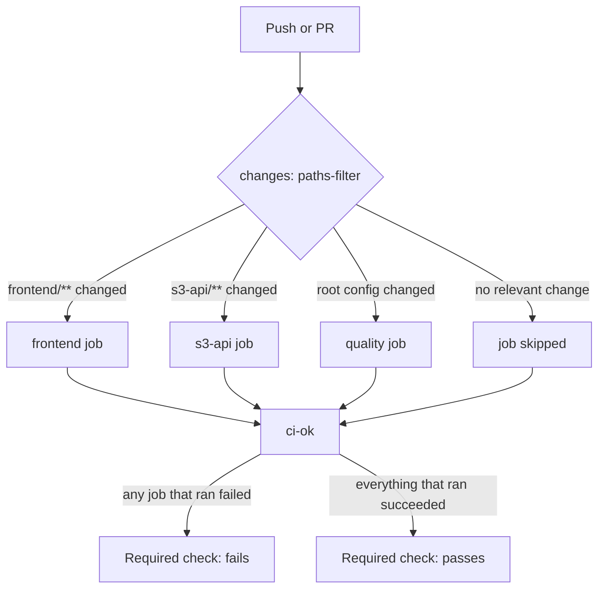

# CI/CD Pipeline

What actually runs when you push or open a PR, read straight from
`.github/workflows/ci.yml` and `.github/workflows/codeql.yml`.

## CI (`ci.yml`)

Triggers on every pull request and on pushes to `main`.



1. **`changes`** - detects which of `frontend/**`, `s3-api/**`, or root config
   files (`package.json`, `pnpm-lock.yaml`, `eslint.config.mjs`,
   `prettier.config.js`, `.prettierignore`, the workflow file itself) changed.
2. **`quality`** - runs if anything relevant changed. Checks Prettier formatting
   across the whole repo and runs ESLint on `frontend/` and `s3-api/`. Lint here
   does **not** use `--max-warnings=0` - the repo currently carries ~98
   pre-existing warnings that are tracked separately, not newly introduced.
   Zero-warning enforcement on touched files happens in the pre-commit hook
   instead (see [Coding Standards](./coding-standards.md)).
3. **`frontend`** - runs only if `frontend/**` changed. Typechecks, tests, and
   builds the Next.js app.
4. **`s3-api`** - runs only if `s3-api/**` changed. Typechecks and builds the
   package.
5. **`ci-ok`** - always runs, and is the single required status check for branch
   protection. It passes if every job that actually ran succeeded, and treats a
   _skipped_ job (because its path filter didn't match) as fine.

That last point matters if you're wondering why branch protection points at
`ci-ok` instead of `frontend`/`s3-api`/`quality` directly: GitHub treats a
skipped job as "never satisfied" for branch protection, so requiring the
individual jobs would permanently block docs-only PRs that never trigger the
`frontend` or `s3-api` jobs. `ci-ok` exists specifically to make path-filtered
CI compatible with required checks.

## CodeQL (`codeql.yml`)

Runs on every PR and push to `main`, plus a weekly scheduled scan (Mondays,
03:17 UTC). Analyzes JavaScript/TypeScript for security issues. It's
informational, not a required check, so it won't block a merge, but findings
show up in the repository's Security tab.

## Running the Same Checks Locally

```bash
pnpm format:check                    # what the quality job's format check runs
pnpm lint                            # what the quality job's lint step runs
cd frontend && pnpm typecheck && pnpm test && pnpm build
cd s3-api && pnpm typecheck && pnpm build
```
