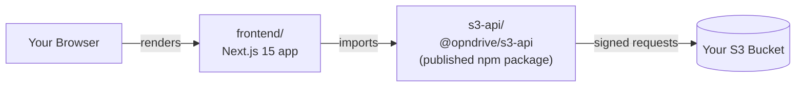

# Introduction

Opndrive is an open-source web UI for Amazon S3 and S3-compatible storage. Think
Google Drive or Dropbox, but instead of your files living on someone else's
servers, they live in a bucket you own and control.

## Why It Exists

Most cloud storage products ask you to trust them with your files. Opndrive
inverts that: you connect your own S3 bucket, and every file operation happens
directly between your browser and AWS. There's no Opndrive-operated server in
between, and no Opndrive-operated database - your AWS credentials live in your
browser's `localStorage`, nowhere else.

## What You Get

- A file browser that behaves like a native file manager: folders, grid/list
  views, search.
- Upload with progress tracking, including multipart uploads for large files and
  multiple upload strategies (see
  [Uploading Files](../guides/uploading-files.md)).
- In-browser preview for images, PDFs, and text files, both as a quick modal and
  as a shareable full-page route (see
  [Previewing Files](../guides/previewing-files.md)).
- Rename, delete, and move for files and folders.
- Dark and light themes.
- Support for any S3-compatible endpoint - AWS, MinIO, DigitalOcean Spaces - not
  just AWS itself.

## How It's Built

There's no backend server and no workspace tooling tying the two packages
together - each is installed and versioned independently. See
[Repository Structure](../development/repository-structure.md) for the full map.

**Tech stack**: Next.js 15, React 19, TypeScript, Tailwind CSS, Zustand + React
Context for state, Vitest for testing.

## Where to Go Next

| I want to...                          | Go to                                                       |
| ------------------------------------- | ----------------------------------------------------------- |
| Run Opndrive and upload a file        | [Installation](./installation.md)                           |
| Deploy it somewhere                   | [Deployment](./deployment.md)                               |
| Understand the codebase               | [Codebase Tour](../development/codebase-tour.md)            |
| Make my first code contribution       | [First Contribution](../contributing/first-contribution.md) |
| Understand the release/branch process | [Maintainers](../maintainers/release-process.md)            |
