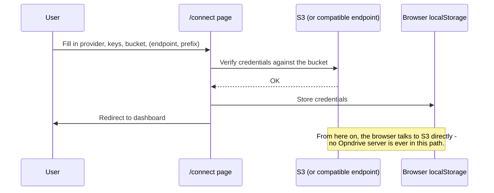

# Connecting Your Storage

The `/connect` page is how every user configures Opndrive - there's no config
file or environment variable involved. It supports AWS and four S3-compatible
providers out of the box, plus any other S3-compatible endpoint via a manual
field.

## Built-in Providers

| Provider      | Endpoint                               |
| ------------- | -------------------------------------- |
| Amazon S3     | Default AWS endpoints, region-based    |
| Wasabi        | `s3.{region}.wasabisys.com`            |
| Backblaze B2  | `s3.{region}.backblazeb2.com`          |
| Cloudflare R2 | `{accountId}.r2.cloudflarestorage.com` |
| MinIO         | Your own server URL                    |

Picking one of these pre-fills the endpoint and region field - you only need to
supply the access key, secret, and bucket name.

## Anything Else S3-Compatible

Select **Amazon S3** as the base provider and fill in the **Endpoint** field
manually. Any service that speaks the S3 API (DigitalOcean Spaces, for example)
works this way, even without a dedicated preset.

## The Form

| Field             | Required                        | Notes                                                     |
| ----------------- | ------------------------------- | --------------------------------------------------------- |
| Access Key ID     | Yes                             |                                                           |
| Secret Access Key | Yes                             |                                                           |
| Region            | Yes                             | Defaults per provider                                     |
| Bucket Name       | Yes                             |                                                           |
| Endpoint          | Only for non-AWS or self-hosted | Pre-filled for known providers                            |
| Prefix            | No                              | Scopes Opndrive to a subfolder, e.g. `projects/documents` |

The **Prefix** field is worth knowing about even if you don't need it now: it
lets one bucket serve multiple Opndrive "roots" - useful if you don't want to
give a user (or yourself) visibility into the whole bucket.

## What Happens on Connect

1. Opndrive builds an S3 client from the form (setting `endpoint` also switches
   the client to path-style addressing, which self-hosted S3 implementations
   generally require).
2. It verifies the credentials work against the bucket.
3. Credentials are written to `localStorage` - never sent to any
   Opndrive-operated server, because there isn't one.
4. You're redirected to the dashboard.

## Disconnecting

User icon → **Clear Session** removes the stored credentials immediately and
returns you to the landing page.

## Required IAM Permissions

At minimum, the connected credentials need `s3:ListBucket`, `s3:GetObject`,
`s3:PutObject`, and `s3:DeleteObject` on the target bucket (and prefix, if
you're using one). If you see permission errors after connecting successfully,
check the bucket policy or IAM policy attached to the access key first - a
successful connection only confirms the credentials are valid, not that every
operation is permitted.

Large uploads also use `s3:AbortMultipartUpload` and `s3:ListMultipartUploads`.
Opndrive calls the abort itself when an upload is cancelled, but it cannot do so
if the tab is closed mid-upload, and the parts left behind are billed while
staying invisible to every normal listing. Set up the lifecycle rule in
[Uploading Files](./uploading-files.md#required-clean-up-incomplete-multipart-uploads)
before putting real data through this.
