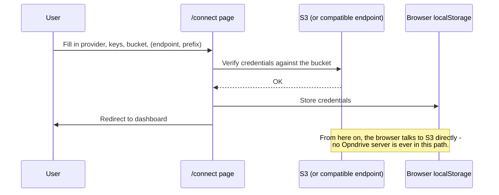

# Connecting Your Storage

The `/connect` page is how every user configures Opndrive - there's no config
file or environment variable involved. It supports AWS and four S3-compatible
providers out of the box, plus any other S3-compatible endpoint via a manual
field.

## Built-in Providers

| Provider      | Endpoint                               |
| ------------- | -------------------------------------- |
| Amazon S3     | Default AWS endpoints, region-based    |
| Wasabi        | `s3.{region}.wasabisys.com`            |
| Backblaze B2  | `s3.{region}.backblazeb2.com`          |
| Cloudflare R2 | `{accountId}.r2.cloudflarestorage.com` |
| MinIO         | Your own server URL                    |

Picking one of these pre-fills the endpoint and region field - you only need to
supply the access key, secret, and bucket name.

## Anything Else S3-Compatible

Select **Amazon S3** as the base provider and fill in the **Endpoint** field
manually. Any service that speaks the S3 API (DigitalOcean Spaces, for example)
works this way, even without a dedicated preset.

## The Form

| Field             | Required                        | Notes                                                     |
| ----------------- | ------------------------------- | --------------------------------------------------------- |
| Access Key ID     | Yes                             |                                                           |
| Secret Access Key | Yes                             |                                                           |
| Region            | Yes                             | Defaults per provider                                     |
| Bucket Name       | Yes                             |                                                           |
| Endpoint          | Only for non-AWS or self-hosted | Pre-filled for known providers                            |
| Prefix            | No                              | Scopes Opndrive to a subfolder, e.g. `projects/documents` |

The **Prefix** field is worth knowing about even if you don't need it now: it
lets one bucket serve multiple Opndrive "roots" - useful if you don't want to
give a user (or yourself) visibility into the whole bucket.

## What Happens on Connect

1. Opndrive builds an S3 client from the form (setting `endpoint` also switches
   the client to path-style addressing, which self-hosted S3 implementations
   generally require).
2. It verifies the credentials work against the bucket.
3. Credentials are written to `localStorage` - never sent to any
   Opndrive-operated server, because there isn't one.
4. You're redirected to the dashboard.

## Switching Buckets

One connection can work with more than one bucket. The bucket you are in is
named in the top bar, next to the menu button - open it to switch.

Opening it lists the buckets those credentials can see. Type to narrow the list;
if there are more than fit in one page, **Load more** fetches the next. The
bucket you are currently in is ticked, and each bucket shows its region when
your provider reports one. Nothing is listed until you open the switcher, so
connecting and browsing never spends a request on it.

Choosing a bucket checks it before anything changes. If the bucket does not
exist, sits in another region, or those keys cannot read it, you stay exactly
where you are and the reason is shown.

A switch starts you at the top of the new bucket. Any prefix you had configured
belongs to the bucket you are leaving, so it is not carried across, and you land
at the new bucket's root rather than at a folder path that probably means
nothing there.

**Uploads and deletes in progress are not thrown away silently.** If any are
still running, switching asks first and tells you how many; they are only
cancelled if you say so. Finished uploads and deletes are cleared from the
operations list when you switch, because they describe the bucket you have left.

### If the bucket list is empty or unavailable

Listing buckets needs an account-level permission that browsing a single bucket
does not (see below), and some S3-compatible providers do not implement bucket
listing at all. Either way your connection is fine - everything else keeps
working.

When that happens the switcher offers a box to type a bucket name into instead.
That path needs no extra permission: the name you type is checked the same way
the connect form checks one, using the same bucket-level access you already
have.

## Disconnecting

User icon → **Clear Session** removes the stored credentials immediately and
returns you to the landing page.

## Required IAM Permissions

At minimum, the connected credentials need `s3:ListBucket`, `s3:GetObject`,
`s3:PutObject`, and `s3:DeleteObject` on the target bucket (and prefix, if
you're using one). If you see permission errors after connecting successfully,
check the bucket policy or IAM policy attached to the access key first - a
successful connection only confirms the credentials are valid, not that every
operation is permitted.

### Listing your buckets is a separate, optional permission

The bucket switcher's **list** needs `s3:ListAllMyBuckets`, which is granted on
the account rather than on a bucket, and which none of the permissions above
imply. It is genuinely optional:

| What you want                           | What the key needs                             |
| --------------------------------------- | ---------------------------------------------- |
| Browse and manage one bucket            | The four bucket-level permissions above        |
| See a list of your buckets to pick from | `s3:ListAllMyBuckets` as well                  |
| Switch to a bucket by typing its name   | Nothing extra - `s3:ListBucket` on that bucket |

Without it the switcher says the list is unavailable and offers a box to type a
bucket name into, which works with the bucket-level permissions you already
have. Switching itself never needs the account-level permission: the check
Opndrive runs against the bucket you are moving to is the same single listing
the connect form makes, so `s3:ListBucket` on that bucket is what decides
whether the switch succeeds.

Large uploads also use `s3:AbortMultipartUpload` and `s3:ListMultipartUploads`.
Opndrive calls the abort itself when an upload is cancelled, but it cannot do so
if the tab is closed mid-upload, and the parts left behind are billed while
staying invisible to every normal listing. Set up the lifecycle rule in
[Uploading Files](./uploading-files.md#required-clean-up-incomplete-multipart-uploads)
before putting real data through this.
