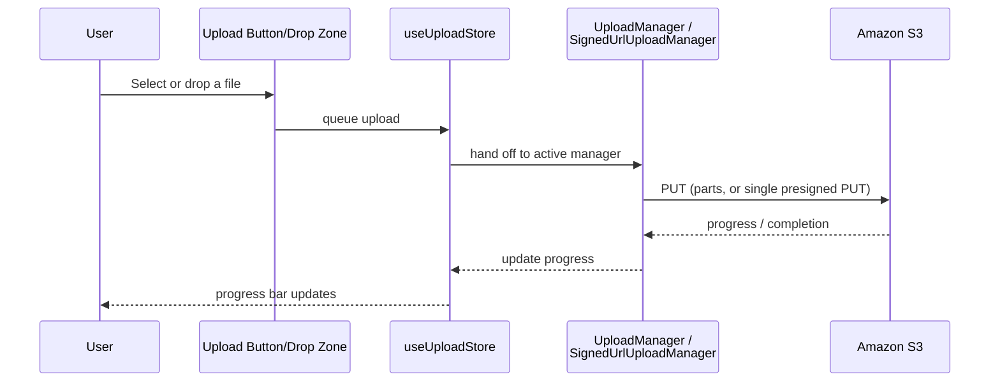

# Uploading Files

Opndrive supports two upload modes. You choose between them in Settings, and the
choice is remembered (`upload-settings-storage` in `localStorage`).

| Mode                    | Best for    | Pause/Resume    | Notes                                                                               |
| ----------------------- | ----------- | --------------- | ----------------------------------------------------------------------------------- |
| **Multipart** (default) | Large files | Yes             | Splits the file into parts uploaded through `@opndrive/s3-api`'s multipart uploader |
| **Signed URL**          | Small files | No, cancel only | Single direct PUT against a presigned URL - less overhead, faster for small files   |

Both modes upload directly from your browser to S3 - no Opndrive-operated server
sits in between.

## How the Mode Switch Actually Works

Switching modes in Settings updates a Zustand store
(`use-upload-settings-store`), which `context/zustand-bridge.tsx` watches and
uses to swap which manager (`UploadManager` for multipart,
`SignedUrlUploadManager` for signed URL) the upload store hands new uploads to.
See
[State Management](../development/state-management.md#where-context-meets-zustand-zustand-bridgetsx)
for the full wiring.

## Uploading



<!-- SCREENSHOT: Upload panel showing multiple files with progress bars, one paused -->

1. Click the upload button, or drag files onto the file list.
2. Track progress per file in the upload panel.
3. With multipart mode, pause and resume an in-progress upload; with signed URL
   mode, cancel is the only control mid-upload.

## Concurrency and Session Changes

Both upload managers are singletons scoped to your current session and bucket.
If you disconnect (Clear Session) or switch buckets, in-flight and queued
uploads are torn down along with the old manager rather than continuing to
target the previous bucket - this is intentional, not a bug: uploading to the
wrong bucket after a credential switch would be worse than losing an in-progress
upload.

## Required: Clean Up Incomplete Multipart Uploads

**Configure a lifecycle rule on your bucket before you rely on Opndrive for
large uploads.** This one is on you rather than on Opndrive, and skipping it
costs money quietly.

Multipart uploads work by sending a file in parts and then issuing a single
"complete" call that assembles them. If that final call never happens - the tab
is closed mid-upload, the laptop sleeps and the connection dies, the browser is
force-quit - the parts that already reached S3 stay there. Opndrive aborts the
upload cleanly whenever it gets the chance, but a closed tab gives the page no
time to send anything, so this case cannot be fixed from the browser.

Orphaned parts behave badly:

- They do **not** appear in the Opndrive file list, or in the S3 console's
  object listing, or in `ListObjectsV2`. Only `ListMultipartUploads` sees them.
- They are **billed as stored data** for as long as they exist.
- Nothing removes them on its own. They persist indefinitely.

The fix is one bucket rule, and every S3-compatible provider supports it.

**AWS Console:** S3 → your bucket → Management → Lifecycle rules → Create rule.
Choose "Apply to all objects in the bucket", tick **Delete expired object delete
markers or incomplete multipart uploads**, then tick **Delete incomplete
multipart uploads** and set 7 days.

**AWS CLI:**

```bash
aws s3api put-bucket-lifecycle-configuration \
  --bucket YOUR_BUCKET_NAME \
  --lifecycle-configuration '{
    "Rules": [
      {
        "ID": "AbortIncompleteMultipartUploads",
        "Status": "Enabled",
        "Filter": {"Prefix": ""},
        "AbortIncompleteMultipartUpload": {"DaysAfterInitiation": 7}
      }
    ]
  }'
```

Seven days is a good default: long enough that a genuinely paused upload can
still be resumed, short enough that abandoned parts do not accumulate. Use 3
days if you upload very large files often. Do not go below 1 day, since the rule
cannot distinguish an abandoned upload from one that is merely slow.

Cloudflare R2, Backblaze B2, MinIO, DigitalOcean Spaces and Wasabi all accept
the same API call; check your provider's console for the equivalent setting.

To see whether you already have orphans:

```bash
aws s3api list-multipart-uploads --bucket YOUR_BUCKET_NAME
```

## Contributing to This Layer

The actual upload logic lives in `@opndrive/s3-api` (`UploadManager`,
`SignedUrlUploadManager`, `MultipartUploader`), not in the frontend. See
[S3 API Layer](../development/s3-api.md) for the implementation-level detail.
