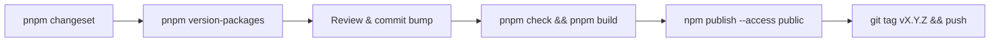

# Release Process

Opndrive uses one version number for the whole monorepo: the root app, the
frontend, the docs site, and the `@opndrive/s3-api` npm package all move
together. That number is what gets git-tagged (`vX.Y.Z`) and is also what
`@opndrive/s3-api` publishes under on npm — there is no separate "app version"
and "package version" to reconcile anymore.

This is enforced with [Changesets](https://github.com/changesets/changesets) in
`fixed` mode (see `.changeset/config.json`): any changeset that touches any
package in the fixed group bumps _all_ of them to the same resulting version.
Versioning is scripted; publishing is still manual, and this page documents what
that manual process involves.



## Adding a changeset

Whenever you make a change worth calling out in a changelog, run:

```bash
pnpm changeset
```

Pick the package(s) you touched and a bump type (patch/minor/major). Because the
fixed group covers `opndrive`, `frontend`, `docs`, and `@opndrive/s3-api`, the
actual version bump applied at release time is the _highest_ bump type requested
across all pending changesets — the group always ends up on one shared number.
Commit the generated file in `.changeset/` with your PR.

Adding a changeset does **not** change any `version` field by itself. Nothing
moves until a maintainer deliberately runs the version step below — so day to
day development doesn't force a release.

## Cutting a release

When it's actually time to release:

1. **Bump versions**: `pnpm version-packages` (`changeset version`). This
   consumes all pending changesets, bumps `package.json` in all four packages to
   the same new version, and writes/updates each package's `CHANGELOG.md`
   (`s3-api/CHANGELOG.MD` for `@opndrive/s3-api`) from the accumulated
   changesets.
2. Review the diff and commit the version bump.
3. **Publish `@opndrive/s3-api`** — from `s3-api/`:
   ```bash
   pnpm check      # typecheck + test
   pnpm build      # tsc, writes to dist/
   npm publish --access public
   ```
4. **Tag the release**: create and push a `git tag vX.Y.Z` matching the new
   shared version. This triggers `.github/workflows/release.yml`, which builds
   and pushes the Docker image to `ghcr.io/opndrive/opndrive` (see
   [Deployment](../getting-started/deployment.md)). The frontend itself isn't
   published to a package registry — it's deployed directly (Vercel/Netlify) and
   otherwise ships via that same Docker image.

## Frontend Workspace Dependency

The frontend consumes `@opndrive/s3-api` through the local PNPM workspace:

```json
"@opndrive/s3-api": "workspace:*"
```

Do not replace that with `pnpm add @opndrive/s3-api@latest` for local repo
development. After changing or publishing `s3-api`, verify the workspace from
the root:

```bash
pnpm typecheck
pnpm build:frontend
```

## A Note on Version Numbers

There is exactly one version number in this repo. `package.json` (root),
`frontend/package.json`, `docs/package.json`, and `s3-api/package.json` always
carry the same `version`, and the git tag for a release always matches it. This
is enforced structurally by the Changesets `fixed` group in
`.changeset/config.json`, not by convention — don't hand-edit a `version` field
directly; add a changeset instead and let `changeset version` apply the bump
everywhere at once.

The number only changes when a maintainer deliberately runs
`pnpm version-packages` — never automatically on merge — so accumulating
changesets during regular development doesn't force an unwanted release.

## Open Improvement

There's still no scripted or CI-driven publish step for `@opndrive/s3-api` or
automated tagging — `changeset version`, `npm publish`, and `git tag` are all
run by hand today. A natural next step is a Changesets GitHub Action that opens
a "Version Packages" PR automatically and publishes on merge, but that needs its
own npm token and CI wiring, and is tracked separately so it doesn't block this
change.
