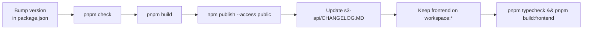

# Release Process

Opndrive ships two different things on two different cadences: the
`@opndrive/s3-api` npm package, and the frontend app itself. Neither has an
automated release workflow today - both are manual, and this page documents what
that manual process actually involves.



## Publishing `@opndrive/s3-api`

`s3-api/package.json` is set up as a real publishable package (`main`, `types`,
`exports`, and `files: ["dist"]` all point at the built output), but there is no
CI step that runs `npm publish` - check `.github/workflows/` and you'll only
find `ci.yml` and `codeql.yml`, neither of which publishes anything. A release
today means, from `s3-api/`:

```bash
# 1. Bump the version
#    (edit "version" in s3-api/package.json, following semver)

# 2. Verify it
pnpm check      # typecheck + test
pnpm build      # tsc, writes to dist/

# 3. Publish
npm publish --access public
```

`s3-api/CHANGELOG.MD` should be updated alongside the version bump so consumers
can see what changed.

## Frontend Workspace Dependency

The frontend consumes `@opndrive/s3-api` through the local PNPM workspace:

```json
"@opndrive/s3-api": "workspace:*"
```

Do not replace that with `pnpm add @opndrive/s3-api@latest` for local repo
development. After changing or publishing `s3-api`, verify the workspace from
the root:

```bash
pnpm typecheck
pnpm build:frontend
```

## Frontend Releases

The frontend (`frontend/package.json`, currently `2.0.0`) isn't published to a
package registry, but pushing a `v*` git tag triggers
`.github/workflows/release.yml`, which builds and pushes a Docker image to
`ghcr.io/opndrive/opndrive` (see
[Deployment](../getting-started/deployment.md)). It's otherwise deployed
directly (Vercel/Netlify). Notable frontend changes go in the root
`CHANGELOG.md`, which follows
[Keep a Changelog](https://keepachangelog.com/en/1.1.0/) and starts from the
point it was added rather than backfilling history. `s3-api` keeps its own
`s3-api/CHANGELOG.MD` because it's versioned and published separately.

## A Note on Version Numbers

The root `package.json` (`1.0.0`), `frontend/package.json` (`2.0.0`), and
`s3-api/package.json` (independently versioned, published to npm) are three
separate version numbers that don't move together. That's expected in this
workspace, but it's worth knowing so a "v2.0.0" mentioned in one context isn't
assumed to mean the same thing in another.

## Open Improvement

The Docker image is now released automatically: pushing a `v*` tag runs
`.github/workflows/release.yml`, which builds the root `Dockerfile` and pushes
it to GHCR tagged with the version, the minor version, and `latest`. A
build-only check also runs in `ci.yml` on pull requests that touch the
`Dockerfile`, `.dockerignore`, or a `package.json`/lockfile, so a broken
Dockerfile is caught before merge instead of at release time.

There's still no scripted or CI-driven release for `s3-api`. If publish
frequency increases, extending `release.yml` (or a separate workflow) triggered
on a version tag, running build + `npm publish`, would remove the manual steps
above and the risk of forgetting one. This needs its own npm token and is
tracked separately so it doesn't block the Docker release.
